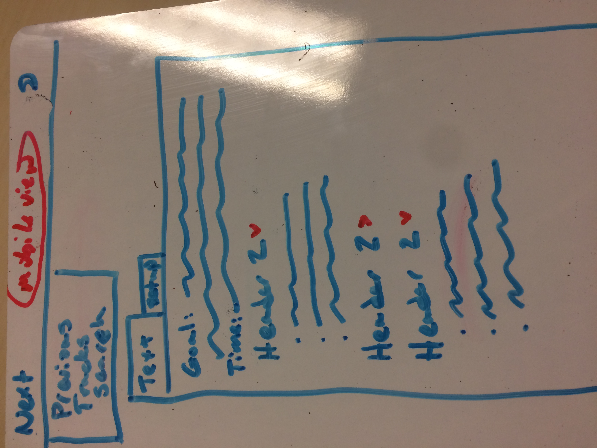
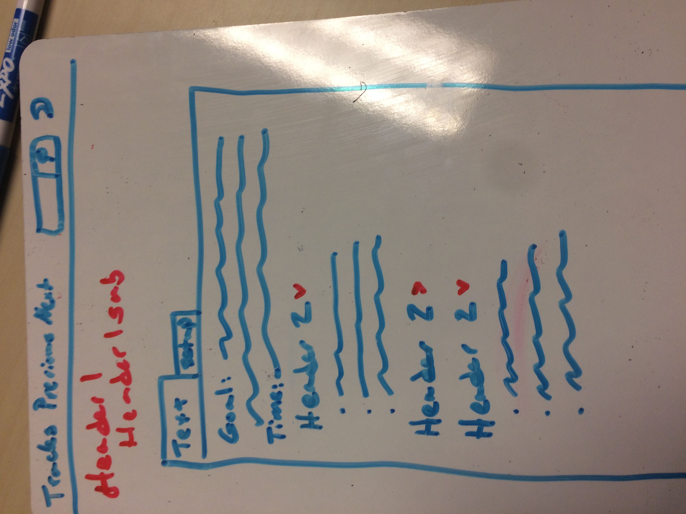
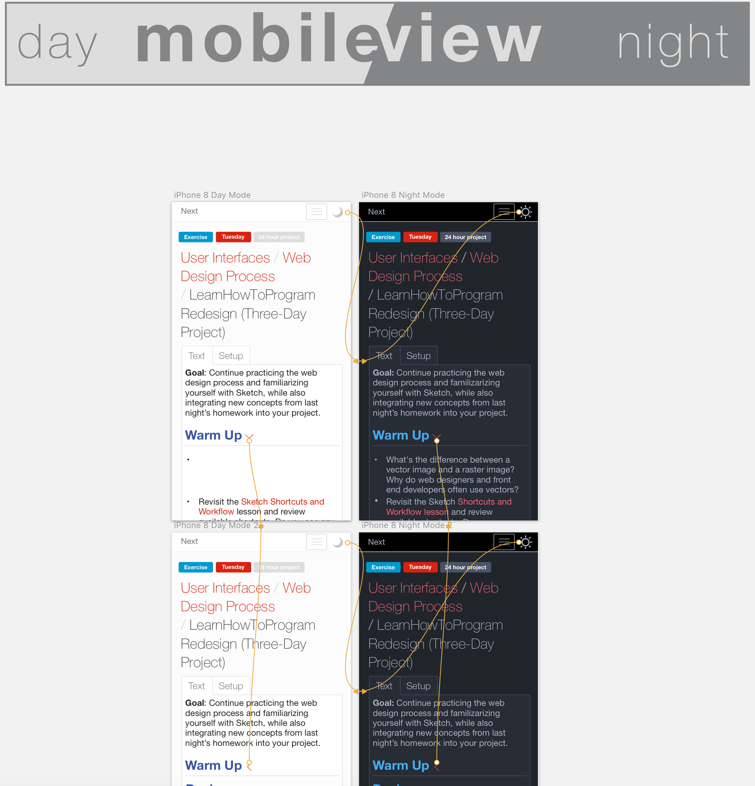
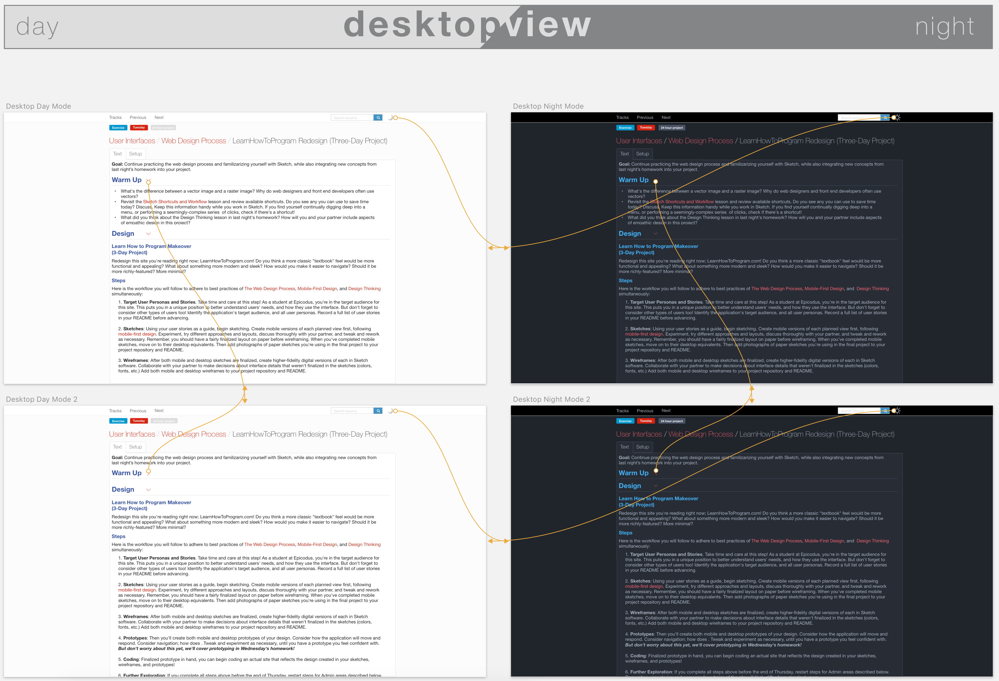
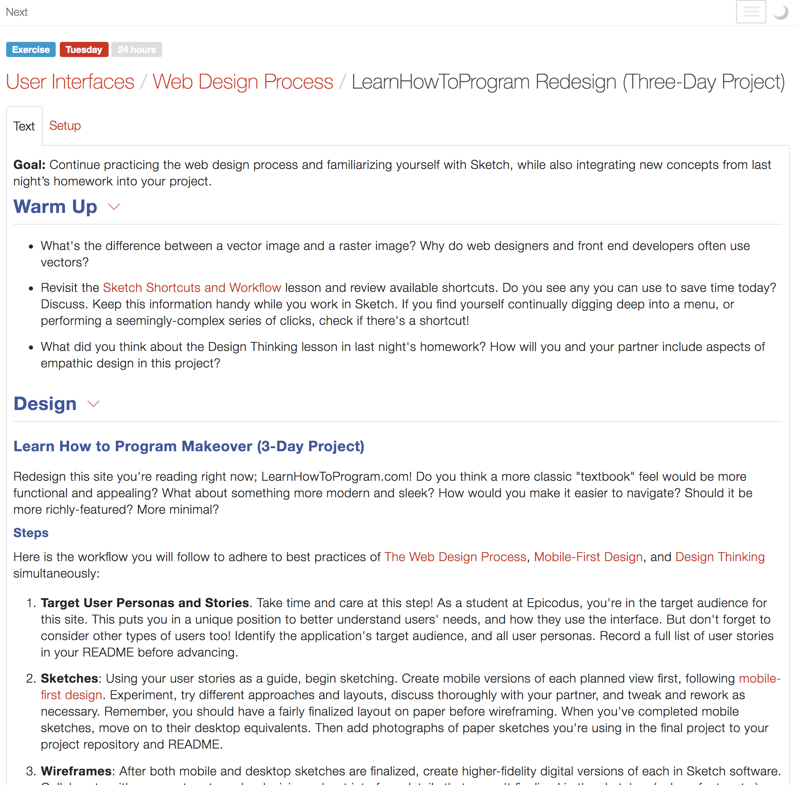
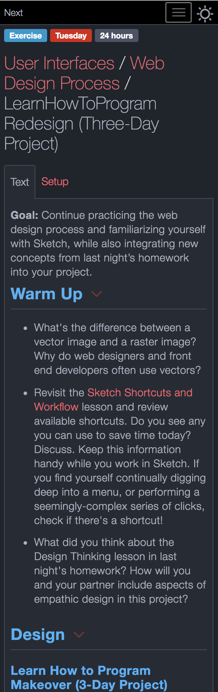

## "Learn to Program" Website Redesign
---

#### Ian Cook Westgate and Slater Smith
#### 2-21-2019

### Description

This redesign of an Epicodus webpage features the inclusion of a night-mode as well as header button functionality that gives the user more control over the amount of information they are confronted with at any time.

### Images

Mobile sketch: 

Desktop sketch: 

Mobile prototype: 

Desktop prototype: 

#### Desktop Version

#### Mobile Version

### User Stories

* As an Epicodus programmer, I want a website that is easier on the eyes that I can look at for long periods of time without irritation.
* As an Epicodus student, I want to know how long the pages are so I can plan my time around the information.
* As an Epicodus student, I want access to a "Setup" tab with links to the pages I end up having to dig for when I need to review how to make a .pairs page, etc.
* As an Epicodus student, I want all the headers collapsible so I'm not overwhelmed with information.

### Technologies and Resources

* HTML
* CSS
  * SASS
* JavaScript
  * jQuery

### Responsiveness

### Setup Instructions

1. Clone this repository @ https://github.com/iwestgate931/ltp-redesign.git
2. Use a terminal of your choice (I use Git Bash) to access the webpage and its files by inputting: "git clone {the above clone link}"
3. Open the folder you receive and open the index.html link in the web browser of your choice (I use Google Chrome).

### Roadmap

Is there work you plan on continuing doing on this project? Features you'd like to add?

* In the mobile view, moving the "Tracks" link from navbar into the dropdown menu, and moving the "Next" link from the dropdown menu into the navbar so that the user can more easily access the "Next" link.
* Adding the duration of pages and videos to the Epicodus table of contents page.

### License

*{This software is licensed under the MIT license}*
Copyright (c) 2019 **_{Ian Cook Westgate and Slater Smith}_**
